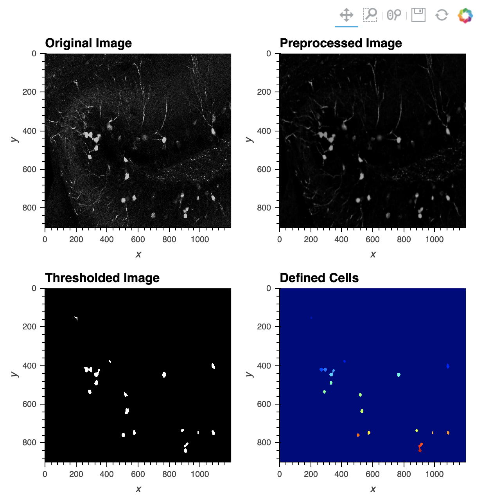

# CellCounting
This repository contains iPython scripts for counting cells in up to two channels, as well as cell overlap across channels, in tif images.  User-drawn regions of interest can also be specified.

## Included Files
* **CellCounter.ipynb** is used to batch process a set of images.  Results of individual images can also be viewed.
* **CellCounter_Optimization.ipynb** allows the user to choose thresholding parameters for cell counting that closely allign with a sample of user's own images that have been counted by hand.
* **ROIdrawer.ipynb** allows the user to draw regions of interest on an image and save 8bit masks, to be used with CellCounter.ipynb to restrict cell counts in an image to a particular region of interest.
* **ImageSplitter.ipynb** allows the user to separate multi-channel RGB images into inividual channel images while preserving bit-depth.
* **CellCounter_Functions.py** contains functions upon which ipynb files depend

# Installation and Package Requirements
The iPython scripts included in this repository require the following packages to be installed in your Conda environment.  Although the package versions used during development are listed it is likely that latest releases of all will be fine to use:
* python (3.6.7)
* jupyter (1.0.0)
* numpy (1.15.2)
* pandas (0.23.0)
* matplotlib (3.1.1) 
* opencv (3.4.3)
* holoviews (1.12.3)
* scipy (1.2.1)
* mahotas(1.4.4)

1. [Download and install Miniconda/Conda](https://conda.io/miniconda.html).  Download version with Python 3.7.  The ‘.pkg’ installer is likely easier for those unfamiliar with coding. See below for an explanation of Conda.

2. Create the CellCounter Conda environment:

    a. For OSX/Linux Users, open Terminal on your computer. If using Windows, open Anaconda Prompt.
    
    b. Copy the following command into Terminal/AnacondaPrompt: `conda create -y -n CellCounter -c conda-forge python=3.6 pandas=0.23.0 matplotlib=3.1.1 opencv=3.4.3 jupyter=1.0.0 holoviews=1.12.3 scipy=1.2.1 mahotas=1.4.4` and hit enter.
        
    c. The CellCounter Conda Environment is now installed.

3. From the CellCounter github page, download all files onto your computer. On the main page of the repository, click the button to ‘Clone or download’, and download the zip folder onto your hard drive (don't forget to unzip the folder). The unzipped folder is called CellCounter-master and contains all files necessary to run the CellCounter.  Alternatively, use git commands if you are familiar with them (`git clone https://github.com/ZachPenn/CellCounting.git`)

4. Activate the CellCounter Conda environment from Terminal/Anaconda Prompt.  On OSX/Linux, use your finder to open Terminal and enter the command: `source activate CellCounter`.  On a Windows os, search for 'Anaconda Prompt'.  Once open, enter the command `conda activate CellCounter`.  

5. Launch Jupyter Notebook from Terminal/Anaconda Prompt (command: `jupyter notebook`). 

**Note that steps 4-5 must be done fresh each time CellCounter is used on your computer.

## Image requirements
Single channel, .tif images are required (8, 16, 32 and 64 bit images should now all work)

If your images are RGB/BGR 3-channel images, you can use ImageSplitter.ipynb to separate them.

## Image J
There are certain tasks relevant to the execution of these scripts (e.g. estimating cell diameters, drawing regions of interest) for which Image J is recommended.  Instructions regarding how to do these tasks in ImageJ are provided in the ipynb files..

## Running Code
After downloading the ipynb files onto your local computer, from the terminal activate the necessary Conda environment and open Jupyter Notebook, then navigate to the files on your computer. The individual scripts contain more detailed instructions.
